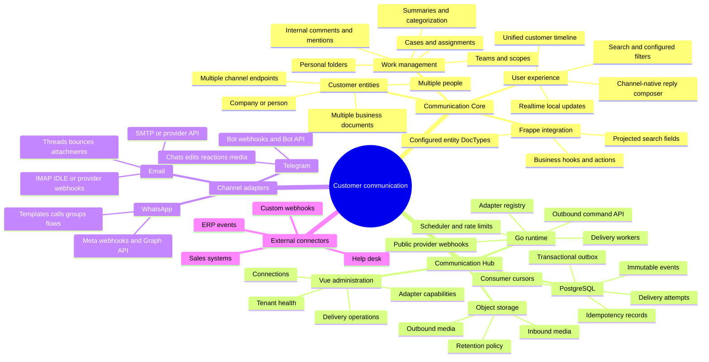

# Communication Platform V2

Status: architecture proposal; implementation has not started.

This plan evolves the WhatsApp-specific product into a channel-neutral customer
communication system without discarding the proven WhatsApp runtime. The target
has two products:

- **Communication Core** is a Frappe app installed beside the customer's
  business applications. It owns customer context, team access, the internal
  workspace, cases, notes, assignments, summaries, filters, and local read
  models.
- **Communication Hub** is a standalone Go service with PostgreSQL, object
  storage, and a Vue administration UI. It owns channel credentials, provider
  ingress and egress, durable transport, retries, rate limits, delivery state,
  and tenant isolation.

WhatsApp, Telegram, and email are adapters. SMS and business-system connectors
can be added later without changing the Core domain.

## Product mind map

## Decisions

1. **A customer is not a phone number.** A customer entity can contain several
   people and each person can have several endpoints: phone, Telegram chat,
   email address, or an external-system identifier.
2. **Do not flatten every endpoint into one transport conversation.** Provider
   ordering, addressing, consent, and reply rules stay in endpoint-scoped
   threads. Core presents an entity-level unified timeline and cases can group
   events from several threads.
3. **Every user-visible item is an event.** Messages, calls, email, delivery
   status, ERP milestones, internal notes, assignments, and case changes use a
   common event envelope with typed payloads.
4. **PostgreSQL is the durable source of truth in Hub.** Transactional outbox,
   inbox, delivery, and cursor tables provide at-least-once delivery and replay.
5. **`LISTEN/NOTIFY` is an optimization, not a queue.** It wakes workers after a
   commit. Workers always claim durable table rows and never depend on a
   notification for correctness.
6. **Core never connects to Hub's database.** Hub delivers signed, tenant-scoped
   batches over HTTPS and exposes cursor-based pull recovery. Core commits the
   batch idempotently before acknowledging it.
7. **Adapters declare capabilities.** The UI only offers actions supported by
   the selected connection and current conversation window.
8. **Existing WhatsApp installations migrate through compatibility contracts.**
   There is no big-bang rewrite and no double-send cutover.

## Current-to-target mapping

| Current component | Target owner | Migration treatment |
| --- | --- | --- |
| `frappe_whatsapp_core` UI and customer records | Communication Core | Generalize behind channel-neutral names while retaining compatibility APIs |
| Hub Frappe management records | Communication Hub | Import tenant, connection, route, and credential metadata through an explicit migration tool |
| Go WhatsApp relay | WhatsApp adapter plus Hub runtime | Reuse provider validation and behavior; move durability to PostgreSQL behind the same command/event contracts |
| NATS JetStream streams and KV | PostgreSQL event/outbox/delivery tables | Drain and reconcile before cutover; retain read-only rollback archive |
| Core WhatsApp Channel | Channel Connection projection | Keep existing links during migration, then map to generic connections |
| Core Identity/Alias/Link | Entity, Person, Endpoint, Entity Binding | Data migration with deterministic keys and collision reports |
| Core Conversation/Message/Event | Thread, Communication Event, Delivery | Preserve provider IDs and idempotency keys |

## Delivery estimate

This is a platform rewrite, not a normal feature release.

| Delivery model | Production-ready estimate |
| --- | --- |
| One strong engineer, sequential work | **24–32 weeks** |
| Focused three-person team: Go/Hub, Frappe/Core, frontend/QA | **12–16 weeks** |
| Demonstration prototype only | **6–8 weeks** |

The production estimate includes compatibility, migration, provider sandboxes,
load tests, security review, failure recovery, observability, and rollback. A
prototype is not safe for customer traffic. External provider/account approval
time is not included.

Detailed documents:

- [Architecture](architecture.md)
- [Channel adapter contract](adapter-contract.md)
- [Migration and delivery plan](migration-and-delivery-plan.md)
- [Test plan](test-plan.md)
- [Architecture review report](review-report.md)
