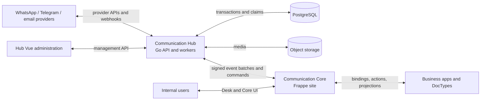
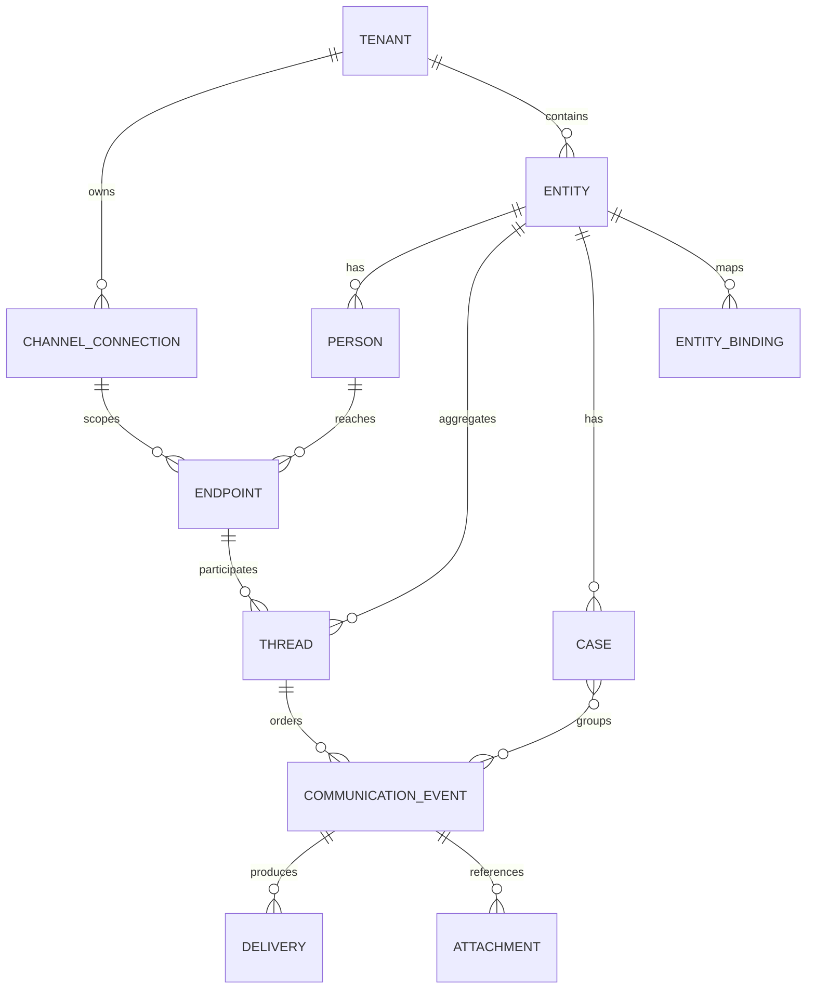
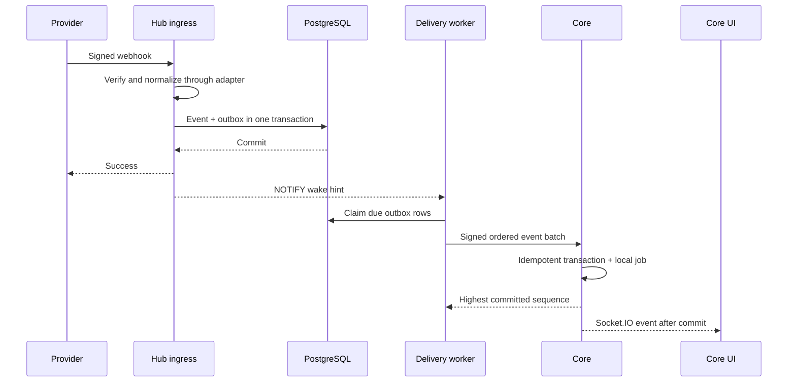

# Architecture

## 1. System boundaries

### Communication Hub owns

- tenant and connection isolation;
- encrypted provider credentials and rotation metadata;
- provider webhook verification and normalized event creation;
- outbound command acceptance, idempotency, scheduling, ordering, rate limits,
  retries, and final delivery state;
- durable event retention, Core subscriptions, replay, and dead-letter state;
- provider media ingestion and object-storage retention;
- operational health, adapter administration, and audit evidence.

### Communication Core owns

- customer entities and bindings to local Frappe documents;
- people, endpoint projections, teams, scopes, assignments, and folders;
- the local searchable customer timeline and message projections;
- cases, internal notes, mentions, tasks, summaries, and categories;
- user permissions and the realtime browser experience;
- configured business actions and outbound intent creation.

Core does not store provider secrets, call provider APIs, connect to Hub
PostgreSQL, or become the durable transport broker.

### Business applications own

- authoritative customer/business records;
- application-specific validation and operations;
- explicit adapters that bind their DocTypes to Core entities and expose safe
  actions. Core does not infer or join arbitrary business schemas at runtime.

## 2. Domain model

### Entity

The customer or business subject shown to internal users. It can represent a
company, household, person, supplier, member, or another configured concept. An
entity has a stable Core key and one or more bindings to local Frappe records.

### Person

A human or role associated with an entity, such as purchasing manager or
accounts contact. A person may be unknown initially and resolved later without
rewriting immutable provider events.

### Endpoint

A provider-addressable identity: WhatsApp phone/BSUID, Telegram chat, email
address, or external-system subject. Endpoints are scoped by a channel
connection because the same visible identifier can have different provider
meaning under another account or bot.

### Thread

An ordered provider conversation for one endpoint and connection. A reply is
always sent through an explicit thread, which preserves provider routing,
ordering, consent, and feature-window rules. Core can render multiple threads
in an entity-level timeline; it must not pretend they share one provider order.

### Communication event

The immutable common envelope. Event types include inbound/outbound message,
status, call, email, reaction, provider edit, business milestone, internal note,
assignment, and case transition. The envelope contains:

- tenant, event ID, correlation ID, causation ID, and schema version;
- channel kind, connection ID, endpoint ID, thread ID, and optional entity ID;
- direction, event type, provider timestamp, Hub received time, and sequence;
- typed payload reference, provider IDs, idempotency key, and trace context;
- classification and retention labels, never plaintext credentials.

Provider payloads are retained in a protected raw-envelope store for bounded
diagnostics. UI code consumes normalized schemas, not provider JSON.

### Case

A business unit of work that can group selected events from any thread belonging
to an entity. Assignment, state, priority, internal notes, and resolution belong
to the case. This is the correct place to combine WhatsApp, Telegram, email, and
ERP evidence for one issue.

### Entity binding and filter projection

An entity can bind to multiple Frappe documents. The business app registers an
allowlisted entity source and an explicit set of filter fields. Core maintains a
denormalized projection for those fields so inbox filtering never performs
arbitrary multi-DocType joins.

Each configured field records its label, source path, type, allowed operators,
normalizer, and sensitivity. Core renders Checkbox, Link, Select, MultiSelect,
Date, numeric range, or fuzzy text components from this safe schema. Business
hooks update the projection after authoritative document changes.

## 3. Hub PostgreSQL model

The logical schemas are:

- `control`: tenants, connections, encrypted secret references, adapter
  versions, webhook routes, limits, and Core subscriptions;
- `event`: append-only normalized events, raw envelope references, provider
  identifiers, and event attachments;
- `command`: immutable outbound commands, recipients, schedules, and provider
  results;
- `delivery`: outbox rows, Core consumer cursors, attempts, leases, retry
  schedules, dead letters, and resolutions;
- `operation`: audit records, adapter executions, reconciliations, and health;
- `projection`: bounded operational summaries used by the Vue administration
  UI. These are rebuildable and not a second source of truth.

Large media and raw message bodies above the configured threshold belong in
object storage; PostgreSQL stores hashes, immutable object keys, content type,
size, encryption metadata, and retention state.

All high-volume tables are tenant-keyed. Time/range partitioning is introduced
only after measured volume warrants it; the repository layer must make later
partitioning transparent.

Each Core subscription has a fixed number of logical delivery partitions. Hub
assigns an event by a stable hash of its ordering key (normally `thread_id`) and
allocates a monotonically increasing sequence inside that partition. The
partition count is versioned and cannot be changed without a cursor migration.
This preserves one thread's order without letting a failed customer thread
block every unrelated customer on the same Core site.

## 4. Durable event delivery

### Why `LISTEN/NOTIFY` is insufficient

PostgreSQL notifications are transient. A disconnected subscriber misses them,
there is no acknowledgement or consumer offset, and they are not a replayable
work log. Therefore Core sites must never rely on direct database subscriptions.

### Transactional outbox pattern

1. Hub writes the normalized event and one outbox row per subscribed Core
   route, assigned to one logical partition, in the same transaction.
2. After commit, Hub issues a small notification containing only a partition or
   tenant hint.
3. Workers wake on the notification and also poll on a bounded interval.
4. A worker claims due rows with `FOR UPDATE SKIP LOCKED`, assigns a lease, and
   commits that short claim transaction. Network I/O never occurs while holding
   row locks or an open claim transaction.
5. The worker sends one bounded, partition-ordered batch over HTTPS. Work for
   other partitions continues independently.
6. Core verifies the signature, tenant, timestamp, schema, and batch hash; it
   inserts every item idempotently in one transaction and enqueues local work.
7. Core acknowledges the highest contiguous sequence committed for that
   subscription partition.
8. Hub advances that partition cursor and finalizes deliveries. A timeout
   safely retries the same batch.

The API also supports partition-scoped cursor reads for authorized pull
recovery. Push and pull share the same subscription/partition/sequence contract,
preventing two sources of truth.

### Retry and dead-letter policy

- Network errors, timeouts, provider 5xx, throttling, and Core unavailability
  retry with exponential backoff plus jitter and provider hints.
- Authentication/configuration failures remain durable and raise an operator
  incident; they do not burn the normal transient retry budget every second.
- Provider validation and policy errors are terminal for the command but still
  generate a final result event.
- A delivery becomes a dead letter only after its configured attempts or age.
  Automatic redrive uses bounded cycles; terminal records are deleted only
  after the retention period and only when their outcome is preserved in the
  operation audit.
- A poison delivery blocks only its thread's ordered lane. After terminal
  quarantine is durably audited, the partition cursor may advance and the gap
  remains explicitly discoverable/redrivable; it is never silently discarded.
- Exactly-once provider delivery is not claimed. The contract is at-least-once
  transport with stable idempotency and effectively-once materialization.

## 5. End-to-end flows

### Provider inbound

### Core outbound

1. Core validates user/team/entity access and the adapter capability projection.
2. Core creates a client idempotency key and submits an immutable command to
   Hub. Hub returns `202 Accepted` only after command/outbox commit.
3. Core shows **queued** only until Hub durably accepts the command. A Hub
   acceptance event moves it to **accepted**; the provider result moves it to
   **sent** or **failed**. Delivery/read events update later where supported.
   WhatsApp presentation maps accepted/sent to one tick, delivered to two ticks,
   and read to the read-colored two ticks; the underlying states remain distinct.
4. Hub schedules and claims the command, invokes the selected adapter, saves the
   provider result and resulting events transactionally, then delivers them to
   Core through the standard event stream.

No UI request waits for the provider.

## 6. Realtime responsibilities

Hub realtime is operational only: connection health, queue depth, and incident
updates for the Vue administration UI.

Customer realtime terminates in Core. Core publishes small typed Socket.IO
events only after database commit. The browser patches visible state instead of
reloading the inbox. Missed browser events are recovered by normal paginated API
reads; Socket.IO is not a data store.

## 7. Security and tenancy

- Every Hub row, index, cache key, object key, metric, and log context carries a
  tenant boundary.
- Repository APIs require tenant scope and PostgreSQL row-level security is used
  as defense in depth for tenant-owned control/data tables where operationally
  practical; privileged maintenance roles are separate and audited.
- Provider credentials are envelope-encrypted through a KMS-backed secret
  service; APIs return capability/status projections, never secret values.
- Hub administration uses a standards-based identity provider (OIDC/OAuth),
  MFA policy, tenant-scoped RBAC, short-lived sessions, CSRF protection, and
  audited privilege changes. The standalone Hub does not invent another
  password store.
- Core routes use independent credentials and asymmetric request signatures or
  mTLS. Signed bodies include route, timestamp, nonce, schema version, and hash.
- Replay protection, bounded payloads, allowlisted content types, decompression
  limits, and SSRF-safe media retrieval are mandatory.
- Adapter code receives a tenant-scoped credential handle, not unrestricted
  database access.
- Core enforces local team/entity permissions on every API and Socket.IO room.
- Audit records are append-only and redact bodies, tokens, email content, and
  personal data by default.

## 8. Availability and scaling

- Hub API instances are stateless and horizontally scalable.
- Workers are independently scalable by adapter, tenant partition, and job
  class. PostgreSQL leases prevent duplicate concurrent ownership.
- Per-tenant and per-connection limiters prevent one customer from exhausting
  the platform.
- PostgreSQL uses connection pooling, bounded transactions, indexed due-work
  scans, replicas for operational reads, point-in-time recovery, and tested
  backups.
- Object storage lifecycle rules enforce media retention without database bloat.
- Core remains usable for its committed history during a Hub outage. New
  commands display a clear unavailable/queued state according to policy and are
  never silently rerouted to a second provider path.

## 9. Explicit non-goals for the first release

- SMS, social-network DMs, and arbitrary third-party adapters;
- cross-tenant entity matching;
- a universal no-code provider adapter builder;
- direct Core-to-PostgreSQL subscriptions;
- replacing Frappe permissions with Hub permissions;
- AI decisions that send, assign, merge identities, or close cases without an
  explicit policy and audit trail.
